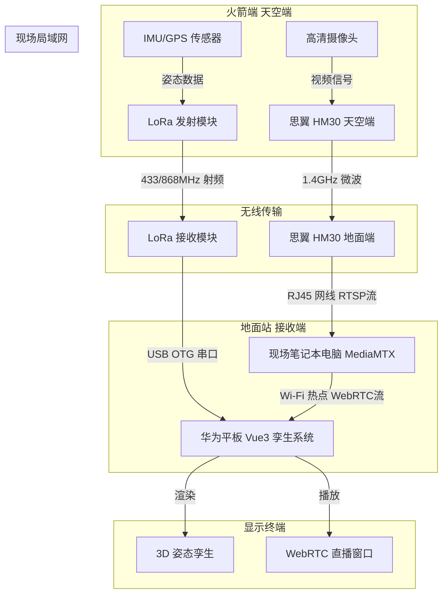

# 火箭数字孪生系统视频直播集成计划

## 架构概述

本计划旨在现有的基于 Vue 3 和 Capacitor 的火箭数字孪生系统（`rocket-twin`）中，集成低延迟的实时视频直播功能。针对冷湖等无公网覆盖的野外环境，采用**双链路架构**：
1.  **遥测数据链路**：LoRa 模块 -> USB 串口 -> 华为平板（已实现，保证 3D 姿态低延迟）。
2.  **视频图传链路**：箭载摄像头 -> 思翼 HM30 天空端 -> (1.4G微波) -> 思翼 HM30 地面端 -> (RJ45网线) -> 现场笔记本电脑 (MediaMTX 流媒体服务器) -> (Wi-Fi 局域网) -> 华为平板 (WebRTC 播放)。

## 实施步骤

### 阶段一：前端 UI 布局调整与播放器集成
1.  **修改主界面布局 (`src/App.vue`)**：
    *   在现有的 HUD 界面中（建议在 `<main class="hud-main">` 的左下角或右下角，例如 `hud-side-left` 的下方），开辟一个用于视频播放的容器。
    *   容器需采用 16:9 比例，并添加符合整体 HUD 科技风格的边框和样式。
    *   添加全屏切换按钮和连接状态指示器。
2.  **引入 WebRTC 播放能力**：
    *   不引入庞大的播放器框架，直接使用 HTML5 `<video>` 标签。
    *   编写用于拉取 MediaMTX WebRTC 流的 JavaScript/TypeScript 逻辑（通常 MediaMTX 会提供一个简单的 `webrtc-streamer` 或原生的 RTCPeerConnection 封装）。

### 阶段二：状态管理扩展
1.  **更新 Store (`src/store/rocket.ts`)**：
    *   添加视频流相关的状态变量，例如 `isVideoConnected` (布尔值)、`videoStreamUrl` (字符串，存储局域网内 MediaMTX 服务器的 WebRTC 地址，如 `http://192.168.137.1:8889/cam/webrtc`)。
    *   提供设置和修改视频流地址的函数，以便在现场根据笔记本的实际 IP 进行调整。

### 阶段三：后端流媒体环境搭建（现场笔记本端）
1.  **部署 MediaMTX**：
    *   在现场笔记本（Windows 或 Linux）上下载并运行开源的 MediaMTX。
    *   配置 MediaMTX 接收来自思翼 HM30 地面端的 RTSP 流。
2.  **网络配置**：
    *   笔记本通过网线连接 HM30 地面端，设置静态 IP。
    *   笔记本开启 Wi-Fi 移动热点，供华为平板连接，形成封闭局域网。

### 阶段四：硬件采购与集成测试
1.  **硬件采购**：按照之前确认的清单采购思翼 HM30 全能套装、天空端供电电池、重型三脚架等。
2.  **地面拉距测试**：在平原无遮挡地带进行 3-5 公里的拉距测试，验证“图传 -> 网线 -> 电脑 MediaMTX -> Wi-Fi -> 平板 WebRTC”全链路的延迟（目标 < 0.5秒）和稳定性。
3.  **火箭总装**：将天空端和摄像头进行减震处理并安装至火箭透波舱段，确保与 LoRa 模块物理隔离。

## 数据流向图

